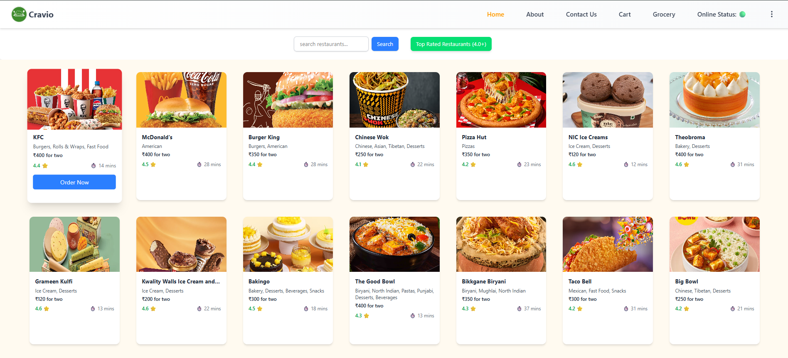
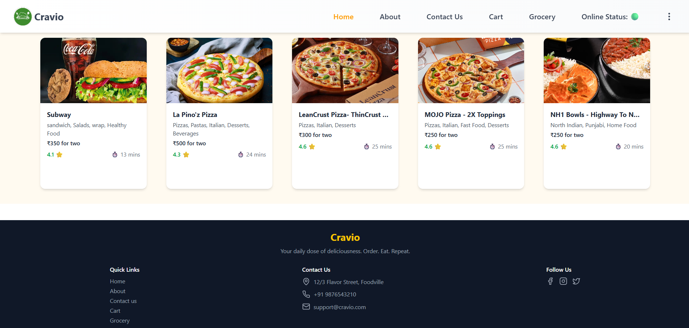
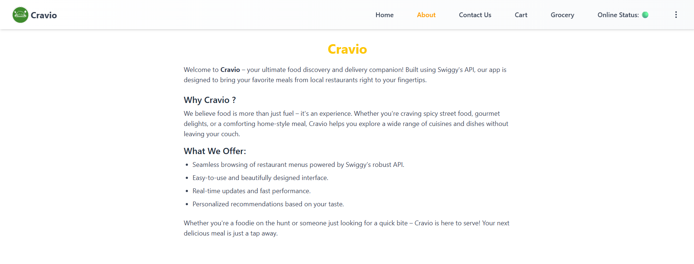
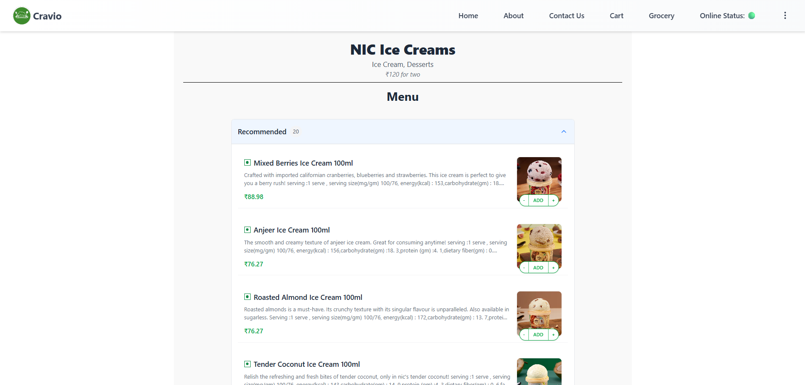
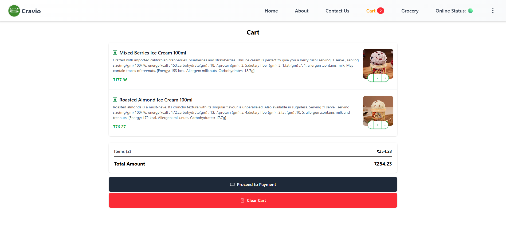
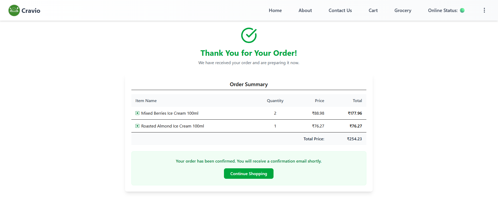
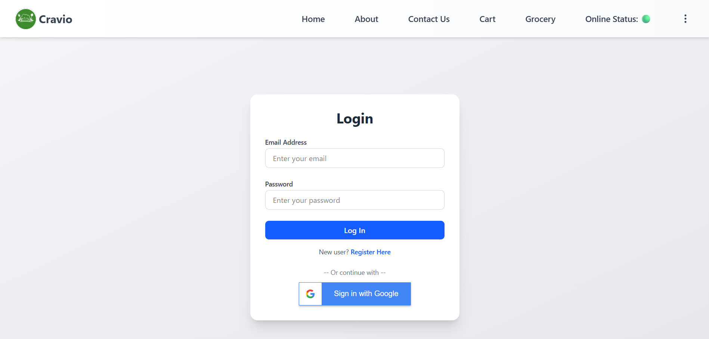
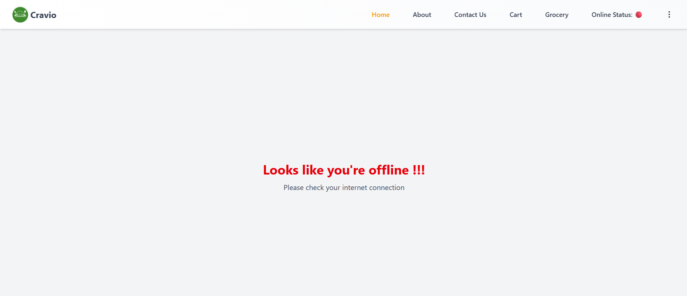

# Cravio - A Food Ordering Platform

Cravio is a Swiggy-inspired food delivery application that lets users browse restaurants, manage cart items, and order meals — all through a responsive and dynamic interface. Built using React, Redux Toolkit, Tailwind CSS, and Firebase, it delivers both performance and scalability.

---

## Overview :

- Developed a feature-rich food delivery app using **React** and **Tailwind CSS**.
- Integrated with **Swiggy’s API** to fetch real-time restaurant and menu data.
- Managed global state using **Redux Toolkit**, along with **redux-persist** for data persistence.
- Implemented **Firebase authentication**, **search functionality**, and **cart management**.
- **Unit and integration tests** written using **Jest** and **React Testing Library** to ensure app reliability.

---

##  Key Features :

- **Restaurant Data Fetching**: Displays restaurant listings using Swiggy’s API.
- **User Authentication**: Integrated Google Sign-In using Firebase.
- **Cart Management**: Add, remove, and persist items in cart across sessions.
- **Search Functionality**: Dynamic filtering for restaurants and dishes.
- **Responsive UI**: Seamless experience across desktop and mobile devices.
- **Routing**: Multi-page navigation via React Router DOM .
- **Online/Offline Detection** : with real-time UI fallback

---

### Technical Details :

- **Frontend**: Built with React.js for dynamic UI and Tailwind CSS for styling.  
- **State Management**: Utilized Redux Toolkit and Redux Persist for managing application state.  
- **API Integration**: Integrated with Swiggy's API for real-time data fetching.  
- **Authentication**: Implemented using Firebase (Google Sign-In).  
- **Routing**: React Router DOM used for client-side routing.  
- **Testing**: Unit and integration testing using Jest, React Testing Library, Babel, and jsdom.  
- **Utilities**: Used React Toastify for notifications, Lucide React for icons, and Google Button for authentication UI.  

---

## Snapshots :

<table>
  <tr>
    <td></td>
    <td></td>
  </tr>
  <tr>
    <td></td>
    <td></td>
  </tr>
  <tr>
    <td></td>
    <td></td>
  </tr>
  <tr>
    <td></td>
    <td></td>
  </tr>
</table>

---

## Setup Instructions :

- Clone the repository : git clone https://github.com/Deepesh-Gaharwar/Cravio-app.git
- Install dependencies : npm install
- Create a .env file and add environment variables such as API_KEY, AUTH_DOMAIN, PROJECT_ID, etc.
- Start the server: npm run dev

---
